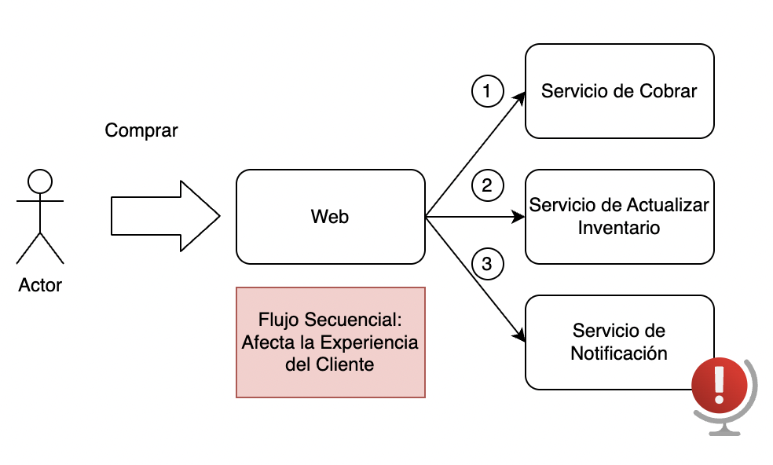

# MOD3-LAB3: Arquitectura Orientada a Eventos en GCP
**Instructor:** Miguel Leyva

---

## 1. Objetivo y Alcance

**Objetivo**
* Implementar una arquitectura desacoplada completa (End-to-End) en Google Cloud Platform.
* Aprender a desplegar infraestructura mediante línea de comandos (`gcloud` CLI) en Cloud Shell.
* Comprender y solucionar desafíos de seguridad e identidad (IAM) en arquitecturas modernas.

**Qué aprenderá el alumno**
* Desplegar un **Frontend Web** interactivo en contenedores usando **Cloud Run**.
* Configurar un bus de eventos robusto usando **Cloud Pub/Sub**.
* Escribir y desplegar múltiples **Microservicios (Cloud Functions 2nd Gen)** trabajando en paralelo mediante el patrón Fan-Out.

---

## 2. Prerrequisitos y herramientas
* Una cuenta activa de Google Cloud Platform (GCP).
* Un proyecto de GCP creado y seleccionado con facturación (Billing) habilitada.
* Permisos de rol de Propietario (Owner) o Editor sobre el proyecto para habilitar APIs y crear recursos.
* Navegador web actualizado (se recomienda Google Chrome).
* Conocimientos básicos de lectura de código en JavaScript y uso de la terminal de comandos.

---

## 3. El problema

En "ShopUTEC", cuando un cliente compra, el sistema web intenta cobrar y enviar un correo en la misma secuencia. Si el servidor de correos falla, la transacción colapsa, la pantalla del usuario muestra un error (Timeout) y se pierden ventas.



## 4. La Solución
La web (Cloud Run) actuará solo como **Publicador**, enviando un mensaje de "Nueva Orden" al bus de eventos (Pub/Sub) y respondiendo inmediatamente al usuario con un mensaje de éxito. Dos microservicios independientes (Cloud Functions) actuarán como **Consumidores**, escuchando el bus y procesando el cobro y el correo en segundo plano de forma segura.


---

## 5. Laboratorio guiado

### FASE 0: Descargar el código fuente

> ⚠️ **Importante:** Todo el código ya está escrito y comentado en el repositorio. No es necesario crear ni copiar código manualmente. Siga estos pasos antes de continuar con la Fase 1.

1. Ingrese a la consola de Google Cloud: https://console.cloud.google.com/
2. Haga clic en el ícono de **Activar Cloud Shell** (`>_`) en la esquina superior derecha y luego en **Autorizar**.
3. En la terminal, clone el repositorio del laboratorio:

```bash
git clone https://github.com/mleyvag/MOD3-LAB3.git
```

4. Ingrese al directorio raíz del proyecto:

```bash
cd ~/MOD3-LAB3
```

5. Verifique que la estructura de carpetas sea correcta:

```bash
ls -la
```

Debería ver las carpetas: `procesar-cobro`, `notificador-email`, `webapp-publisher` y `gestor-inventario`.

---

### FASE 1: Preparar el ambiente

1. Asegúrese de tener un proyecto de GCP seleccionado en la consola.
2. En la terminal de Cloud Shell, habilite todas las APIs necesarias para el laboratorio:

```bash
gcloud services enable \
  cloudresourcemanager.googleapis.com \
  pubsub.googleapis.com \
  cloudfunctions.googleapis.com \
  eventarc.googleapis.com \
  run.googleapis.com \
  artifactregistry.googleapis.com \
  cloudbuild.googleapis.com
```

3. Asigne el rol de **Cloud Build Builder** a la Cuenta de Servicio de Compute Engine. Este permiso es necesario para que Cloud Build pueda compilar y empaquetar el código fuente durante los despliegues:

```bash
PROJECT_ID=$(gcloud config get-value project)

PROJECT_NUMBER=$(gcloud projects describe $PROJECT_ID --format='value(projectNumber)')

gcloud projects add-iam-policy-binding $PROJECT_ID \
    --member=serviceAccount:$PROJECT_NUMBER-compute@developer.gserviceaccount.com \
    --role=roles/cloudbuild.builds.builder
```

---

### FASE 2: Crear el Bus de Eventos

Cree el tópico de Pub/Sub donde la WebApp publicará los mensajes de nuevas órdenes de compra. Los microservicios suscriptores de las fases siguientes escucharán este tópico:

```bash
gcloud pubsub topics create ordenes-compra-[iniciales]
```

---

### FASE 3: Desplegar Cloud Run Function "Procesar Cobro"

Este microservicio se suscribe al tópico `ordenes-compra` y simula el procesamiento del cobro de cada orden.

> 📂 Código fuente: `procesar-cobro/index.js` y `procesar-cobro/package.json`

1. Navegue al directorio del servicio:
```bash
cd ~/MOD3-LAB3/procesar-cobro
```

2. Revise el código fuente en el editor de Cloud Shell antes de desplegarlo (opcional pero recomendado):
```bash
cat index.js
```

3. Despliegue la función conectada al tópico de Pub/Sub como trigger:
```bash
gcloud functions deploy procesar-cobro-[iniciales] \
  --gen2 \
  --runtime=nodejs22 \
  --region=us-central1 \
  --source=. \
  --entry-point=helloPubSub \
  --trigger-topic=ordenes-compra-[iniciales]
```

4. Confirme con la tecla `y` si se solicita autorización.

> ⏱️ El despliegue tarda aproximadamente 2-3 minutos.

---

### FASE 4: Desplegar Cloud Run Function "Notificador Email"

Este microservicio se suscribe al **mismo tópico** que `procesar-cobro`. Pub/Sub entregará una copia del mensaje a cada suscriptor, activando ambas funciones **en paralelo** (patrón Fan-Out).

> 📂 Código fuente: `notificador-email/index.js` y `notificador-email/package.json`

1. Navegue al directorio del servicio:
```bash
cd ~/MOD3-LAB3/notificador-email
```

2. Despliegue la función apuntando al mismo tópico `ordenes-compra`:
```bash
gcloud functions deploy notificador-email-[iniciales] \
  --gen2 \
  --runtime=nodejs22 \
  --region=us-central1 \
  --source=. \
  --entry-point=helloPubSub \
  --trigger-topic=ordenes-compra-[iniciales]
```

3. Confirme con la tecla `y` si se solicita autorización.

---

### FASE 5: Desplegar Cloud Run "WebApp Publisher"

Esta es la aplicación web que el usuario final utiliza para realizar compras. Su única responsabilidad es publicar el evento en Pub/Sub y responder inmediatamente al usuario. **No espera ni conoce** a los microservicios que procesan la orden en segundo plano.

> 📂 Código fuente: `webapp-publisher/index.js` y `webapp-publisher/package.json`

1. Navegue al directorio del servicio:
```bash
cd ~/MOD3-LAB3/webapp-publisher
```

2. Cambiar la linea 64 del archivo `index.js`. Ir a la `Terminal > Open Editor` (Se abrirá el VSCode). Buscar el archivo y cambiar por el valor correcto.

```javascript
...
await pubsub.topic('ordenes-compra-[iniciales]').publishMessage({ data });
...
```

3. Posterior al cambio se tiene que guardar el archivo en `File > Save`. Luego hacer clic en `Open Terminal` para regresar a la terminal de los comandos.

4. Despliegue como un servicio de Cloud Run (contenedor, no función):
```bash
gcloud run deploy webapp-publisher-[iniciales] \
  --source=. \
  --region=us-central1 \
  --allow-unauthenticated \
  --quiet
```

> 💡 El flag `--allow-unauthenticated` permite que cualquier usuario acceda al frontend sin necesidad de autenticarse. En producción se restringe con Identity-Aware Proxy (IAP).

---

### FASE 6: Seguridad y Permisos (IAM)

Por defecto, la Cuenta de Servicio del contenedor de Cloud Run **no tiene permiso para escribir en Pub/Sub**. Si omite este paso, recibirá un error `PERMISSION_DENIED` al intentar realizar una compra.

Ejecute el siguiente bloque para otorgar el rol de publicador de Pub/Sub a la Cuenta de Servicio de Compute Engine:

```bash
PROJECT_ID=$(gcloud config get-value project)
PROJECT_NUMBER=$(gcloud projects describe $PROJECT_ID --format="value(projectNumber)")

gcloud projects add-iam-policy-binding $PROJECT_ID \
  --member="serviceAccount:${PROJECT_NUMBER}-compute@developer.gserviceaccount.com" \
  --role="roles/pubsub.publisher"
```

> ⏱️ Espere aproximadamente **30 segundos** después de ejecutar este comando para que los permisos se propaguen en la infraestructura de GCP antes de realizar pruebas.

---

## 6. Pruebas y validación

El sistema ya está completamente operativo. Para verificar su funcionamiento:

**1. Usar el Frontend:**
* En su terminal, localice la URL generada por Cloud Run al final del despliegue (tiene la forma `https://webapp-publisher-xxxxx-uc.a.run.app`). También puede consultarla con:
```bash
gcloud run services describe webapp-publisher-[iniciales] --region=us-central1 --format='value(status.url)'
```
* Abra la URL en su navegador.
* Llene el formulario con datos de prueba y haga clic en **Confirmar Compra**. Verá la pantalla de confirmación de forma **inmediata**, sin esperar al cobro ni al correo.

**2. Validar el Backend (Logs):**
* Vaya a la consola de GCP y abra el servicio **Cloud Run**.
* Haga clic en `procesar-cobro-[iniciales]` → pestaña **Logs**. Verá el log `[COBRO] ✅ Pago procesado...`.
* Regrese y haga clic en `notificador-email` → **Registros**. Verá el log `[EMAIL] 📧 Correo enviado...`.
* Compare las marcas de tiempo: ambas funciones se ejecutaron **en paralelo**, con una diferencia de milisegundos.

---

## 7. Laboratorio propuesto

Implemente el tercer suscriptor del patrón Fan-Out: el microservicio **"Gestor Inventario"**.

> 📂 El código base ya está disponible en la carpeta `gestor-inventario/` del repositorio. Léalo, comprénda el patrón y despliegue el servicio siguiendo las instrucciones.

**Instrucciones del reto:**

1. Navegue al directorio del reto:
```bash
cd ~/MOD3-LAB3/gestor-inventario
```

2. Revise y comprenda el código en `index.js`. Modifique el mensaje de log si lo desea, por ejemplo:
```
[INVENTARIO] 📦 Separando stock en almacén para la orden: ORD-XXXX
```

3. Despliegue la nueva Cloud Function asegurándose de conectarla al **mismo tópico**:
```bash
gcloud functions deploy gestor-inventario-[iniciales] \
  --gen2 \
  --runtime=nodejs22 \
  --region=us-central1 \
  --source=. \
  --entry-point=helloPubSub \
  --trigger-topic=ordenes-compra-[iniciales]
```

> 🔑 **Pista clave:** El parámetro `--trigger-topic=ordenes-compra-[iniciales]` es lo que conecta este tercer suscriptor al mismo bus de eventos. Pub/Sub se encarga de entregar la misma orden a los tres microservicios de forma automática.

4. **Validación final:** Realice una nueva compra desde la WebApp y verifique en los **Registros (Logs)** de Cloud Run que las **tres funciones** (`procesar-cobro`, `notificador-email` y `gestor-inventario`) se dispararon simultáneamente procesando la misma orden.

---

## 8. Limpieza de Recursos

> ⚠️ Ejecute estos comandos al finalizar el laboratorio para evitar cargos continuos en su cuenta de GCP.

```bash
# Eliminar las Cloud Run Functions (suscriptores)
gcloud functions delete procesar-cobro-[iniciales]   --gen2 --region=us-central1 --quiet
gcloud functions delete notificador-email-[iniciales] --gen2 --region=us-central1 --quiet
gcloud functions delete gestor-inventario-[iniciales] --gen2 --region=us-central1 --quiet

# Eliminar el servicio Cloud Run (frontend/publicador)
gcloud run services delete webapp-publisher-[iniciales] --region=us-central1 --quiet

# Eliminar el tópico de Pub/Sub (bus de eventos)
gcloud pubsub topics delete ordenes-compra-[iniciales] --quiet
```
